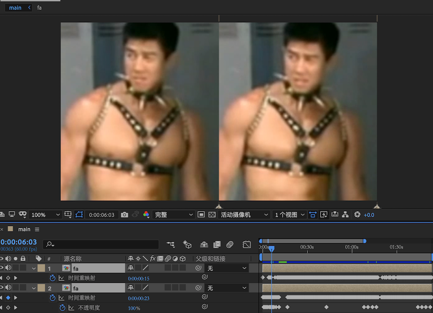

### 鬼畜自动化脚本

适用人群：熟悉python和ae的人

#### 用途及最终效果

做这个主要是用来做鬼畜自动化，希望可以拿到midi后快速得到视频。

主要流程是用python读取midi文件，得到不同轨道每个音符的区间。然后ae脚本给视频加上时间重映射的关键帧，达到反复播放的效果。

（音频部分自动化需另行处理，可使用fl studio等）

#### 使用方法

##### 使用默认曲目

需要：ae

1. 打开ae，新建合成，导入并修剪视频，使其只剩下循环部分，将其拉入合成，选中此视频，直接运行addKeys.jsx脚本。（midi.txt需与脚本在同一目录）

##### 想要用自己的时间数据（容易报错）

###### 方法1 colab

需要：科学上网

1. 将readMidi.ipynb上传到colab
2. 将所需midi传至界面左边的文件里
3. 将`path = '/content/DJ Yoshitaka - FLOWER.mid'`改为所需文件后运行
4. 在左侧将得到的txt文件下载下来

###### 方法2 本地运行

需要：python

1. 去[github](https://github.com/louisabraham/python3-midi)下载midi库，然后`python setup.py install`

2. 然后命令行运行`python3 readMidi.py filename.midi`得到midi.txt文件
3. 最后像上一方法中描述的那样在ae中运行脚本。

